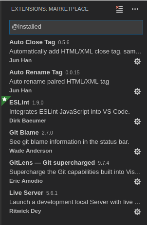

# vscode-setup-for-js-development

I just wanted to setup my VSCode before I start learning Javascript. Knowing your tool is what makes you more efficeint.


## Extensions

Here are the list of extensions which I use.



> Note that I will make sure to update this as I go along.

## Setting up ESLint
Local Installation and Usage
If you want to include ESLint as part of your project’s build system, we recommend installing it locally. You can do so using npm:

```
$ npm install eslint --save-dev
```
You should then setup a configuration file:

```
$ ./node_modules/.bin/eslint --init
```
After that, you can run ESLint in your project’s root directory like this:

```
$ ./node_modules/.bin/eslint yourfile.js
```
Instead of navigating to ./node_modules/.bin/ you may also use npx to run eslint:

```
$ npx eslint
```
> Note: If ESLint wasn’t manually installed (via npm), npx will install eslint to a temporary directory and execute it.

Any plugins or shareable configs that you use must also be installed locally to work with a locally-installed ESLint.

Global Installation and Usage
If you want to make ESLint available to tools that run across all of your projects, we recommend installing ESLint globally. You can do so using npm:

```
$ npm install -g eslint
```
You should then setup a configuration file:

```
$ eslint --init
```
After that, you can run ESLint on any file or directory like this:

```
$ eslint yourfile.js
```
Any plugins or shareable configs that you use must also be installed globally to work with a globally-installed ESLint.

> Note: eslint --init is intended for setting up and configuring ESLint on a per-project basis and will perform a local installation of ESLint and its plugins in the directory in which it is run. If you prefer using a global installation of ESLint, any plugins used in your configuration must also be installed globally.